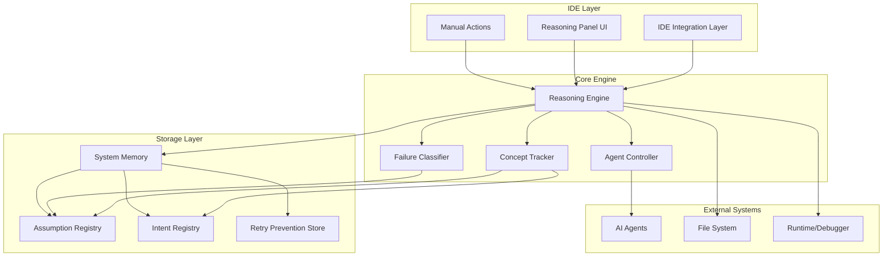

# Design Document: CodeSensei

## Overview

CodeSensei is a lightweight reasoning and learning layer that operates as a plugin alongside AI-powered IDEs. The system addresses critical inefficiencies in current AI coding workflows by providing intelligent context injection, failure analysis, and persistent code understanding. Unlike replacement tools, CodeSensei enhances existing AI agents (Cursor, Copilot, Cody) by making them more reliable, cost-effective, and educational.

The architecture follows a modular design with clear separation between the reasoning engine, persistent storage, IDE integration, and AI agent governance. The system operates primarily in silent mode, only surfacing insights when explicitly requested or when critical failures occur.

## Architecture

CodeSensei employs a layered architecture with the following key components:



### Component Responsibilities

- **IDE Integration Layer**: Provides plugin interface, reasoning panel, and manual action triggers
- **Reasoning Engine**: Central orchestrator that coordinates all system components
- **Concept Tracker**: Identifies and tracks programming concepts, patterns, and relationships
- **Failure Classifier**: Analyzes execution failures and categorizes root causes
- **Agent Controller**: Intercepts and enhances AI agent interactions
- **Storage Components**: Persist system knowledge across sessions

## Components and Interfaces

### Reasoning Engine

The Reasoning Engine serves as the central coordinator, implementing the core workflow:

```typescript
interface ReasoningEngine {
  // Silent initialization
  initialize(projectPath: string): Promise<void>
  
  // Continuous observation
  observeCodeChange(change: CodeChange): void
  observeExecution(result: ExecutionResult): void
  
  // AI agent governance
  interceptAIRequest(request: AIRequest): Promise<EnhancedAIRequest>
  
  // On-demand reasoning
  activateBugReasoningMode(context: FailureContext): ReasoningResult
  activateLearningMode(scope: LearningScope): LearningResult
  
  // System state
  getSystemConcepts(): Concept[]
  getFailureHistory(): FailureRecord[]
}
```

### Concept Tracker

Identifies and tracks programming concepts across the codebase:

```typescript
interface ConceptTracker {
  identifyConcepts(code: CodeFragment): Concept[]
  trackConceptRelationships(concepts: Concept[]): ConceptGraph
  updateConceptRegistry(concepts: Concept[]): void
  
  // Concept types: authentication, async operations, data flow, 
  // caching, error handling, state management, etc.
}

interface Concept {
  id: string
  type: ConceptType
  location: CodeLocation
  relationships: ConceptRelationship[]
  confidence: number
  lastUpdated: timestamp
}
```

### Agent Controller

Governs AI agent interactions by injecting context and constraints:

```typescript
interface AgentController {
  interceptRequest(request: AIRequest): Promise<EnhancedAIRequest>
  injectContext(request: AIRequest, context: SystemContext): EnhancedAIRequest
  addConstraints(request: EnhancedAIRequest): EnhancedAIRequest
  
  // Supported agents: Cursor, Copilot, Cody, etc.
  registerAgent(agent: AIAgent): void
}

interface SystemContext {
  relevantConcepts: Concept[]
  activeAssumptions: Assumption[]
  recentIntent: Intent[]
  failureHistory: FailureRecord[]
}
```

### Failure Classifier

Analyzes execution failures and provides structured explanations:

```typescript
interface FailureClassifier {
  classifyFailure(error: ExecutionError, context: ExecutionContext): FailureClassification
  identifyViolatedAssumptions(failure: FailureClassification): Assumption[]
  generateExplanation(failure: FailureClassification): StructuredExplanation
}

interface FailureClassification {
  type: FailureType // logic_error, assumption_violation, integration_issue
  confidence: number
  rootCause: string
  affectedConcepts: Concept[]
  suggestedActions: Action[]
}
```

### Storage Interfaces

Persistent storage for system knowledge:

```typescript
interface AssumptionRegistry {
  store(assumption: Assumption): void
  retrieve(conceptId: string): Assumption[]
  update(assumptionId: string, assumption: Assumption): void
  findViolated(failure: FailureClassification): Assumption[]
}

interface IntentRegistry {
  capture(intent: Intent): void
  retrieve(codeLocation: CodeLocation): Intent[]
  link(intent: Intent, concepts: Concept[]): void
}

interface SystemMemory {
  persist(): Promise<void>
  restore(projectPath: string): Promise<SystemState>
  optimize(): void // Cleanup old/irrelevant data
  synchronize(): Promise<void> // Multi-device sync
}
```

## Data Models

### Core Data Structures

```typescript
// Code understanding
interface CodeChange {
  type: 'create' | 'modify' | 'delete'
  location: CodeLocation
  content: string
  timestamp: number
  significance: SignificanceLevel
}

interface CodeLocation {
  file: string
  startLine: number
  endLine: number
  startColumn: number
  endColumn: number
}

// System concepts
interface Concept {
  id: string
  type: ConceptType
  name: string
  description: string
  location: CodeLocation
  relationships: ConceptRelationship[]
  confidence: number
  metadata: Record<string, any>
}

enum ConceptType {
  AUTHENTICATION = 'authentication',
  ASYNC_OPERATION = 'async_operation',
  DATA_FLOW = 'data_flow',
  CACHING = 'caching',
  ERROR_HANDLING = 'error_handling',
  STATE_MANAGEMENT = 'state_management',
  API_INTEGRATION = 'api_integration',
  DATABASE_ACCESS = 'database_access'
}

// Intent and assumptions
interface Intent {
  id: string
  description: string
  codeLocation: CodeLocation
  relatedConcepts: string[] // Concept IDs
  timestamp: number
  confidence: number
}

interface Assumption {
  id: string
  description: string
  type: AssumptionType
  relatedConcepts: string[]
  codeLocation: CodeLocation
  isViolated: boolean
  violationHistory: ViolationRecord[]
}

enum AssumptionType {
  DATA_FORMAT = 'data_format',
  API_BEHAVIOR = 'api_behavior',
  PERFORMANCE = 'performance',
  SECURITY = 'security',
  BUSINESS_LOGIC = 'business_logic'
}

// Failure analysis
interface ExecutionError {
  message: string
  stackTrace: string
  errorType: string
  timestamp: number
  context: ExecutionContext
}

interface ExecutionContext {
  activeCode: CodeLocation[]
  systemState: Record<string, any>
  environmentInfo: EnvironmentInfo
}

interface FailureRecord {
  id: string
  classification: FailureClassification
  resolution: Resolution | null
  timestamp: number
  recurrenceCount: number
}

// AI agent integration
interface AIRequest {
  prompt: string
  context: string
  agent: string
  timestamp: number
}

interface EnhancedAIRequest extends AIRequest {
  injectedContext: SystemContext
  constraints: Constraint[]
  expectedTokenReduction: number
}

// Learning and reasoning
interface ReasoningResult {
  explanation: StructuredExplanation
  visualizations: Visualization[]
  actionableInsights: Insight[]
  confidenceScore: number
}

interface LearningResult {
  conceptExplanations: ConceptExplanation[]
  architectureViews: ArchitectureView[]
  learningPath: LearningStep[]
  adaptedToLevel: SkillLevel
}
```

### Storage Schema

The system uses a hybrid storage approach:
- **In-memory**: Active concepts, current session state
- **Local files**: Project-specific knowledge (JSON/SQLite)
- **Optional cloud sync**: Cross-device synchronization

```typescript
interface ProjectKnowledge {
  projectId: string
  concepts: Concept[]
  assumptions: Assumption[]
  intents: Intent[]
  failureHistory: FailureRecord[]
  retryPrevention: RetryRecord[]
  lastUpdated: number
  version: string
}
```

## Correctness Properties

*A property is a characteristic or behavior that should hold true across all valid executions of a system—essentially, a formal statement about what the system should do. Properties serve as the bridge between human-readable specifications and machine-verifiable correctness guarantees.*

Based on the prework analysis and property reflection to eliminate redundancy, the following properties capture the essential correctness requirements for CodeSensei:

### Property 1: Silent Context Loading
*For any* project with existing context data, initializing CodeSensei should load all previous concepts, assumptions, and intent without displaying notifications or prompts to the user
**Validates: Requirements 1.1, 1.3**

### Property 2: Context Loading Performance
*For any* project context of reasonable size (up to 10MB), loading should complete within 2 seconds regardless of the amount of stored knowledge
**Validates: Requirements 1.2, 1.5**

### Property 3: Project Context Isolation
*For any* set of multiple open projects, the system should load and maintain context specific to the currently active project without cross-contamination
**Validates: Requirements 1.4**

### Property 4: Concept Identification Accuracy
*For any* code containing common programming patterns (authentication, async operations, data flow, caching), the Concept_Tracker should identify at least 85% of the concepts correctly
**Validates: Requirements 2.1, 2.5**

### Property 5: Concept Relationship Tracking
*For any* sequence of code modifications, the system should automatically track and update concept relationships and dependencies without user intervention
**Validates: Requirements 2.2, 2.4**

### Property 6: Silent Registry Updates
*For any* newly detected or modified concepts, the system should update the concept registry without displaying notifications to the user
**Validates: Requirements 2.3**

### Property 7: AI Request Interception and Enhancement
*For any* AI agent request, the Agent_Controller should intercept it, inject relevant context from registries, and add appropriate constraints before forwarding
**Validates: Requirements 3.1, 3.2, 3.3**

### Property 8: Token Usage Reduction
*For any* AI interaction with context injection, token usage should be reduced by at least 20% compared to the same request without CodeSensei governance
**Validates: Requirements 3.4, 11.1**

### Property 9: Intent and Assumption Capture
*For any* significant code change, the system should automatically identify and store the underlying intent and assumptions with proper linkage to code locations and related concepts
**Validates: Requirements 4.1, 4.2, 4.3, 4.4**

### Property 10: Architectural Decision Coverage
*For any* codebase containing architectural decisions and design patterns, the system should capture intent for at least 90% of these decisions
**Validates: Requirements 4.5**

### Property 11: Failure Classification Accuracy
*For any* execution failure, the Failure_Classifier should correctly categorize the failure type and identify violated assumptions with at least 80% accuracy for common error patterns
**Validates: Requirements 5.1, 5.2, 5.5**

### Property 12: Structured Failure Explanations
*For any* classified failure, the system should provide structured explanations that reference violated assumptions and related concepts, rather than generic error messages
**Validates: Requirements 5.3, 5.4**

### Property 13: Bug Reasoning Mode Effectiveness
*For any* Bug Reasoning Mode activation, the system should analyze failure context, present visual reasoning, and provide actionable insights in at least 75% of cases
**Validates: Requirements 6.1, 6.2, 6.3, 6.4, 6.5**

### Property 14: Learning Mode Content Quality
*For any* Learning Mode activation, the system should provide enhanced explanations, visual representations, and project-specific content adapted to the developer's demonstrated knowledge level
**Validates: Requirements 7.1, 7.2, 7.3, 7.5**

### Property 15: Mode Switching Behavior
*For any* mode transition (Learning Mode to silent, Bug Reasoning Mode to normal), the system should cleanly switch operational behavior without affecting core functionality
**Validates: Requirements 7.4**

### Property 16: Retry Prevention Effectiveness
*For any* failed solution approach, the system should record the failure, warn about similar future attempts, suggest alternatives, and reduce repeated failed attempts by at least 60%
**Validates: Requirements 8.1, 8.2, 8.3, 8.5**

### Property 17: Success Pattern Learning
*For any* approach that succeeds after modification, the system should update its success/failure patterns to improve future recommendations
**Validates: Requirements 8.4**

### Property 18: Knowledge Persistence Round-Trip
*For any* system state containing concepts, assumptions, and intent, persisting at session end and restoring at session start should preserve all data without loss
**Validates: Requirements 9.1, 9.2**

### Property 19: Memory Optimization Preservation
*For any* large system memory state, optimization should reduce storage size while preserving all critical information needed for system operation
**Validates: Requirements 9.3**

### Property 20: Cross-Device Synchronization
*For any* system memory changes on one device, synchronization should propagate changes to other devices while maintaining data consistency
**Validates: Requirements 9.4**

### Property 21: Memory Persistence Reliability
*For any* persistence operation under normal conditions, the system should maintain 99.9% reliability in storing and retrieving system memory
**Validates: Requirements 9.5**

### Property 22: IDE Integration Initialization
*For any* IDE startup, the IDE_Integration_Layer should initialize the reasoning panel interface and provide contextual manual action options without blocking the coding workflow
**Validates: Requirements 10.1, 10.2, 10.3**

### Property 23: Silent Operation Continuity
*For any* reasoning panel state (open or closed), the core system should continue silent operation and maintain all background functionality
**Validates: Requirements 10.4**

### Property 24: Resource Usage Efficiency
*For any* continuous operation period, the system should maintain CPU and memory overhead below 5% of total system resources
**Validates: Requirements 11.4**

### Property 25: Response Quality Improvement
*For any* AI response with CodeSensei enhancement, relevance should improve by at least 30% compared to unenhanced responses
**Validates: Requirements 11.3**

### Property 26: Cost Reduction Through Retry Prevention
*For any* development session with retry prevention active, failed iteration costs should be reduced by at least 40% compared to sessions without the system
**Validates: Requirements 11.2**

### Property 27: Multi-Language Concept Recognition
*For any* code written in supported programming languages, the Concept_Tracker should identify language-specific patterns and maintain concept relationships across language boundaries
**Validates: Requirements 12.1, 12.3**

### Property 28: Framework Pattern Understanding
*For any* code using supported frameworks, the system should understand framework-specific architectural patterns and adapt to new frameworks through learning
**Validates: Requirements 12.2, 12.4**

### Property 29: Language and Framework Coverage
*For any* launch configuration, the system should demonstrate working support for at least 5 major programming languages and 10 popular frameworks
**Validates: Requirements 12.5**

## Error Handling

CodeSensei implements comprehensive error handling across all components:

### Graceful Degradation Strategy
- **Context Loading Failures**: Continue with empty context, log silently
- **Concept Tracking Errors**: Skip problematic code sections, maintain partial tracking
- **AI Agent Interception Failures**: Fall back to direct agent communication
- **Storage Failures**: Use in-memory fallback, attempt recovery on next operation

### Error Classification and Recovery
```typescript
enum ErrorSeverity {
  LOW = 'low',        // Log and continue
  MEDIUM = 'medium',  // Attempt recovery, notify if persistent
  HIGH = 'high',      // Disable affected component, maintain core functionality
  CRITICAL = 'critical' // Safe shutdown, preserve data
}

interface ErrorHandler {
  handleError(error: SystemError): RecoveryAction
  attemptRecovery(component: SystemComponent): boolean
  escalateError(error: SystemError): void
}
```

### Data Integrity Protection
- **Atomic Operations**: All registry updates use atomic transactions
- **Backup and Recovery**: Automatic backup before major operations
- **Corruption Detection**: Checksum validation for stored data
- **Rollback Capability**: Ability to revert to last known good state

## Testing Strategy

CodeSensei employs a dual testing approach combining unit tests for specific scenarios and property-based tests for comprehensive validation.

### Property-Based Testing
Property-based testing validates universal correctness properties across many generated inputs using **Hypothesis** (Python) or **fast-check** (TypeScript). Each property test runs a minimum of 100 iterations to ensure comprehensive coverage.

**Property Test Configuration:**
- **Minimum iterations**: 100 per property test
- **Test tagging**: Each test references its design document property
- **Tag format**: `Feature: code-sensei, Property {number}: {property_text}`

**Key Property Test Areas:**
- Context loading and persistence (Properties 1-3, 18-21)
- Concept identification and tracking (Properties 4-6, 27-29)
- AI agent governance and enhancement (Properties 7-8, 25)
- Failure analysis and reasoning (Properties 11-13)
- Performance and resource usage (Properties 2, 8, 24-26)

### Unit Testing Balance
Unit tests complement property tests by focusing on:
- **Specific examples**: Concrete scenarios that demonstrate correct behavior
- **Edge cases**: Boundary conditions and unusual inputs
- **Integration points**: Component interactions and data flow
- **Error conditions**: Specific failure scenarios and recovery paths

**Unit Test Focus Areas:**
- IDE integration and UI behavior
- Specific concept recognition patterns
- Error handling and recovery scenarios
- Configuration and setup procedures

### Testing Infrastructure
- **Mocking Strategy**: Mock external dependencies (IDE APIs, file system, AI agents)
- **Test Data Generation**: Synthetic codebases and realistic failure scenarios
- **Performance Testing**: Automated benchmarks for critical performance properties
- **Integration Testing**: End-to-end workflows with real IDE environments

The dual approach ensures both correctness (property tests verify universal rules) and reliability (unit tests catch specific bugs and edge cases).